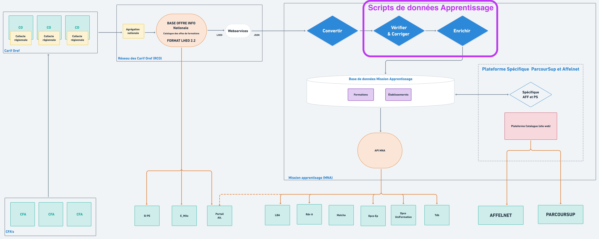

# Traitements sur la données pour l'Apprentissage - en cours

Ici nous parlons des scripts permettant de vérifier, corriger et enrichir la donnée provenant des Carif Oref.

Pour des soucis de lisibilité dans cette partie, ci-dessous le diagramme simplifié autour des traitements de données :

