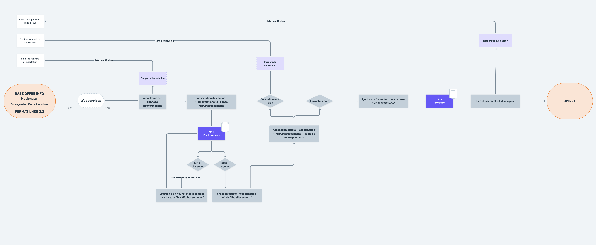

# Traitements sur la données pour l'Apprentissage

Le contexte l’apprentissage impose une certaine quantité de vérifications ainsi que des précisions sur la données de formation et d'établissements. Ainsi afin de facilité la consommation de l'offre de formation et des informations établissements du catalogue, la MNA effectue une série de traitements décrit dans ce chapitre.  
Vous trouverez les détails des traitements permettant de **vérifier, corriger et enrichir** la donnée provenant des Carif-Oref régionale.  
  
Pour des besoins de lisibilité dans ce chapitre, ci-dessous le diagramme simplifié centré autour des traitements de données :

### Flux macro de traitements

Vous trouverez les détails de chaque traitements dans les pages suivantes : 





