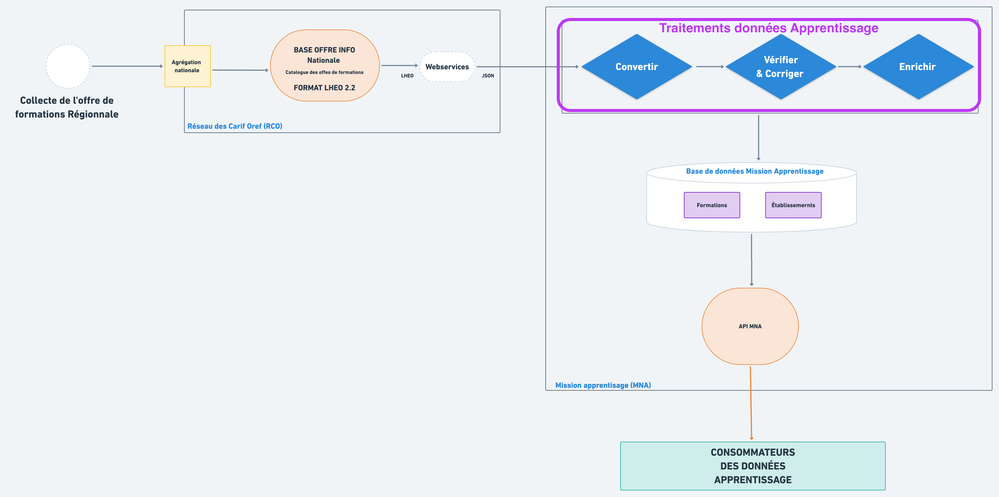
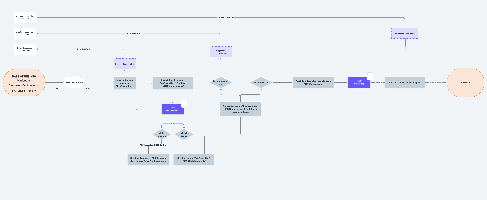

# Traitements sur les données pour l'Apprentissage

Le contexte de l’apprentissage impose une certaine quantité de vérifications ainsi que des précisions sur les données de formations et d'établissements. Ainsi afin de faciliter la consommation de l'offre de formation et des informations établissements du catalogue, la MNA effectue une série de traitements décrits dans ce chapitre.  
Vous trouverez les détails des traitements permettant de **vérifier, corriger et enrichir** la donnée provenant des Carif-Oref régionaux.  
  
Pour des besoins de lisibilité dans ce chapitre, ci-dessous le diagramme simplifié centré autour des traitements de données :

### Flux macro de traitements

Vous trouverez les détails de chaque traitement dans les pages suivantes : 





