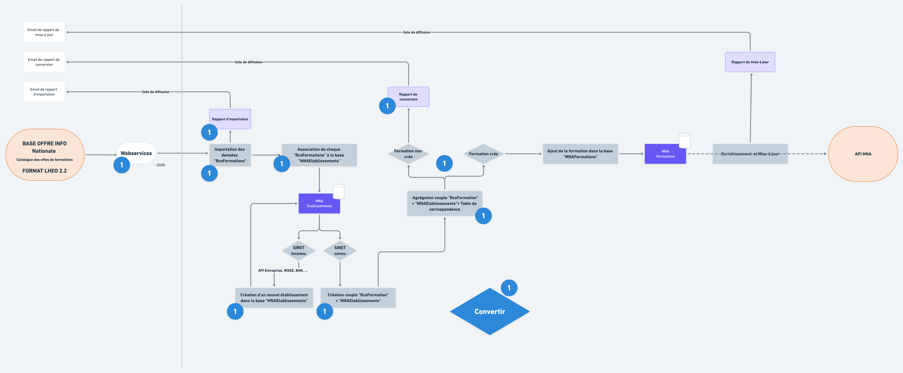

# Convertir

Le bloc de conversion permet principalement le passage du format Lhéo vers un Format consommable et améliorable dans le cadre de l'apprentissage. 

Ci-dessus les boîtes marquées1⃣correspondent à l'étape de conversion.

### Pourquoi ce traitement  ?

Le format Lhéo [http://lheo.gouv.fr/](http://lheo.gouv.fr/) est articulé autour de la notion d'action de formation étant dispensée dans un établissement.   
Dans le contexte de l’apprentissage, il est nécessaire d'articuler l'offre de formations autour de la notion d’établissement portant des formations, afin notamment de vérifier leur conventionnement \([cf. Traitements liés aux établissements](../../traitements-scripts/etablissements.md)\).

De plus, sur les données des formations il est nécessaire d'ajouter les différents codes pivots pour les différents consommateurs \([cf. Traitements liés aux formations](../../traitements-scripts/traitements-lies-aux-formations/)\).

