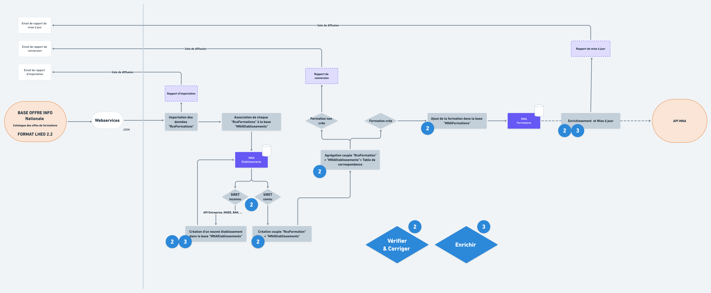

# Vérifier, corriger et enrichir

Ci-dessus les boites marquées:two:correspondent à l'étape de vérification et correction, et celles marquées:three:à l'étape d'enrichissement.

Retrouvez tous les détails des traitements dans le chapitre : 


[Broken link](broken-reference)


