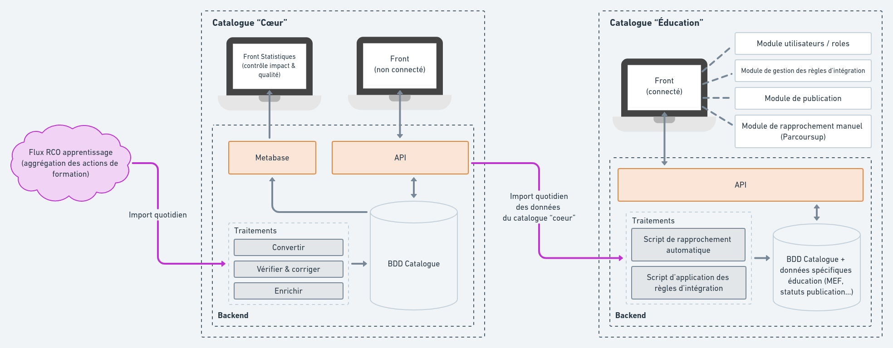

# Architecture technique pour la passation

## Le contexte

Afin de transmettre aux parties prenantes les modules et les données qui leur sont spécifiques, il est apparu que le meilleur moyen est de scinder le catalogue actuel en deux :

* un catalogue **"cœur"** qui va gérer la vérification et l'enrichissement des données, l'exposition par api, le contrôle de la qualité des données, etc. 
* un catalogue **"éducation"** dédié aux ministères éducatifs pour alimenter en formations en apprentissage Affelnet et Parcoursup. Cette application pourra être déployée de façon indépendante pour chacun des ministères éducatifs, ou mutualisée selon le besoin.

## Vue d'ensemble

## Métriques

### Décompte des lignes de code du catalogue par module pour Parcoursup

Nous n'avons pas encore fait la séparation entre le code cœur du catalogue et le code spécifique pour les ministères éducatifs.

Il y a un bloc squelette à prendre côté backend \(7500 lignes environ\) et le tout le code du front \(20K lignes environ\) :

* Réconciliation / Rapprochement - back 1200 lignes / front 2500 lignes
* Périmètre - back 800 lignes / front 2000 lignes
* Publication - back 100 lignes / front 500 lignes
* Gestion des utilisateurs - back 500 lignes / front 1000 lignes
* Gestion des rôles / droits - back 200 lignes / front 500 lignes
* Squelette backend - back 7 500 lignes
* Total frontend - front 20 000 lignes

