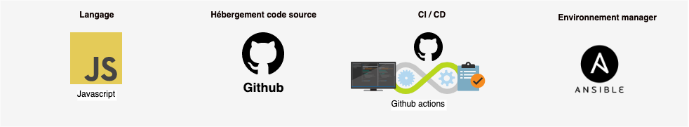
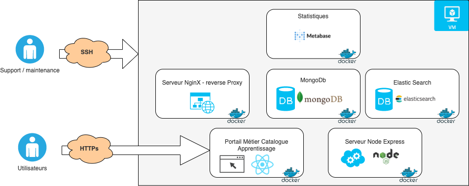

# Architecture technique actuelle

### Vue d'ensemble



### Architecture



#### &#x20; Front

* React JS

#### &#x20;Back

* Server/ API : Node JS
* Base de données : MongoDB
* Moteur de recherche: Elastic Search
* Statistique: Metabase
* Reverse Proxy: Nginx

## Décompte des lignes de code

### Back

```
> npx cloc server/src/

-------------------------------------------------------------------------------
Language                     files          blank        comment           code
-------------------------------------------------------------------------------
CSV                              2              0              0         107875
JavaScript                     148           1507           1048          13043
EJS                              9             39              0            588
JSON                             6              0              0            583
Markdown                         2             27              0             44
-------------------------------------------------------------------------------
SUM:                           167           1573           1048         122133
-------------------------------------------------------------------------------
```

### Front

```
> npx cloc ui/src/

-------------------------------------------------------------------------------
Language                     files          blank        comment           code
-------------------------------------------------------------------------------
JavaScript                     144            966             83          12201
JSX                             58            386             36           6978
CSS                              4             20              3            582
JSON                             1              0              0             80
SVG                              5              0              0             15
-------------------------------------------------------------------------------
SUM:                           212           1372            122          19856
-------------------------------------------------------------------------------
```

