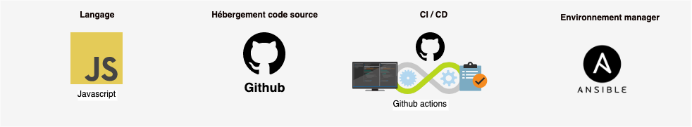

# Architecture technique actuelle

### Vue d'ensemble



### Architecture


####   Front

* React JS

####  Back

* Server/ API : Node JS
* Base de données : MongoDB
* Moteur de recherche: Elastic Search
* Statistique: Metabase
* Reverse Proxy: Nginx

## Décompte des lignes de code

### Back

```text
> npx cloc server/src/

-------------------------------------------------------------------------------
Language                     files          blank        comment           code
-------------------------------------------------------------------------------
JavaScript                     156           1581           1039          12951
JSON                             6              0              0           1548
EJS                              9             39              0            589
Markdown                         1             17              0             32
-------------------------------------------------------------------------------
SUM:                           172           1637           1039          15120
-------------------------------------------------------------------------------
```

### Front

```text
> npx cloc ui/src/

-------------------------------------------------------------------------------
Language                     files          blank        comment           code
-------------------------------------------------------------------------------
JavaScript                     128            684            137          10172
JSX                             68            449            378           8393
CSS                              4             20              3            586
JSON                             1              0              0             72
SVG                              5              0              0             15
-------------------------------------------------------------------------------
SUM:                           206           1153            518          19238
-------------------------------------------------------------------------------
```


