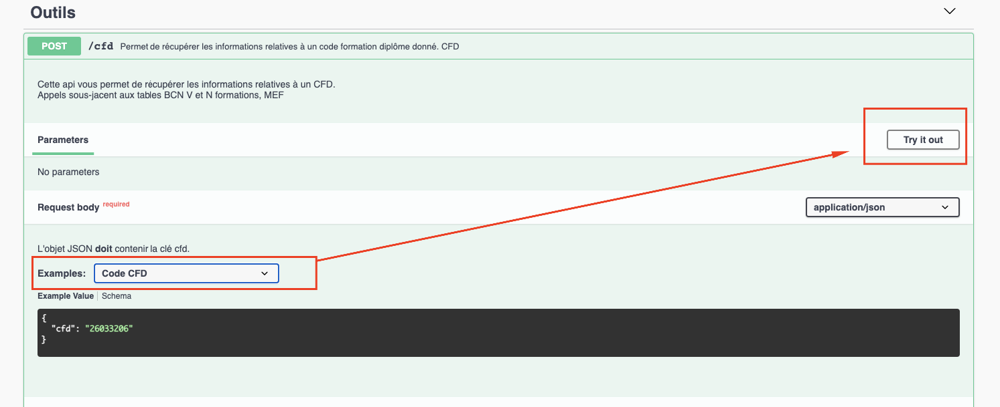

# CFD - Code Formation Diplôme

## En entrée ?

Un code cfd dont je recherche les informations détaillées. Défini comme ci-dessous 

<table>
  <thead>
    <tr>
      <th style="text-align:left">
        <p>CDF</p>
        <p></p>
      </th>
      <th style="text-align:left">
        <p>50022427</p>
        <p>(<a href="http://infocentre.pleiade.education.fr/bcn/workspace/viewTable/n/V_FORMATION_DIPLOME">table</a>)</p>
      </th>
      <th style="text-align:left">ARTS ET TECHNIQUES DU VERRE OPTION DECORATEUR (CAP)</th>
    </tr>
  </thead>
  <tbody>
    <tr>
      <td style="text-align:left">500</td>
      <td style="text-align:left">Niveau formation dipl&#xF4;me (<a href="http://infocentre.pleiade.education.fr/bcn/index.php/workspace/viewTable/n/N_NIVEAU_FORMATION_DIPLOME/nbElements/20">table</a>)</td>
      <td
      style="text-align:left">
        <p>CERTIFICAT D&apos;APTITUDES PROFESSIONNELLES</p>
        <p><em>! la table des niveaux n&#x2019;est pas &#xE0; jour</em>
        </p>
        </td>
    </tr>
    <tr>
      <td style="text-align:left">224</td>
      <td style="text-align:left">Groupe sp&#xE9;cialit&#xE9; ou NSF (<a href="http://infocentre.pleiade.education.fr/bcn/workspace/viewTable/n/N_GROUPE_SPECIALITE">table</a>)</td>
      <td
      style="text-align:left">MATERIAUX DE CONSTRUCTION, VERRE, CERAM.</td>
    </tr>
    <tr>
      <td style="text-align:left">27</td>
      <td style="text-align:left">Num&#xE9;ro d&#x2019;ordre</td>
      <td style="text-align:left"></td>
    </tr>
    <tr>
      <td style="text-align:left"></td>
      <td style="text-align:left">Lettre sp&#xE9;cialit&#xE9;</td>
      <td style="text-align:left">(Optionnel)</td>
    </tr>
  </tbody>
</table>

**Exemple pour le CAP Arts et technique du verre - option décorateur :**

* liste les formations qui existent de droit et reconnues par l'état
* dépend du ministère de l'Education Nationale
* utilisé par Ministère de l’éducation nationale et de la jeunesse \(MENJ\) et le Ministère de l’enseignement supérieur, de la recherche et de l’innovation \(MESRI\)
* Ce code est forcément sur **8 caractères alphanumériques**

## En sortie ?

Ce que je peux récupérer à partir CFD. 

<table>
  <thead>
    <tr>
      <th style="text-align:left">Nom du champ</th>
      <th style="text-align:left">Description</th>
      <th style="text-align:left">Type</th>
    </tr>
  </thead>
  <tbody>
    <tr>
      <td style="text-align:left">cfd</td>
      <td style="text-align:left">
        <p>La valeur du code formation dipl&#xF4;me <b>Mise &#xE0; jour </b>&#x26A0;&#xFE0F;</p>
        <p>Peu importe le CFD recherch&#xE9; ce champ retournera le CFD le plus &#xE0;
          jour possible bas&#xE9; sur les informations de la BCN. Si le cfd est diff&#xE9;rent
          alors le champ cfd_outdated sera &#xE0; <em><code>true</code></em>.</p>
      </td>
      <td style="text-align:left">string</td>
    </tr>
    <tr>
      <td style="text-align:left">cfd_outdated</td>
      <td style="text-align:left">
        <p>Indique si le CFD recherch&#xE9; n&apos;est plus &#xE0; jour.</p>
        <p>Si vrai alors la valeur de champ cfd est diff&#xE9;rente de celle recherch&#xE9;e.</p>
      </td>
      <td style="text-align:left">bolean</td>
    </tr>
    <tr>
      <td style="text-align:left">date_fermeture</td>
      <td style="text-align:left">
        <p>Date &#xE0; laquelle le code recherch&#xE9; a ferm&#xE9;.</p>
        <p>Si la valeur est &#xE9;gale &#xE0; <em><code>null</code></em> alors ce code
          est en vigueur.</p>
      </td>
      <td style="text-align:left">date | null</td>
    </tr>
    <tr>
      <td style="text-align:left">specialite</td>
      <td style="text-align:left">Retourne l&apos;information de sp&#xE9;cialit&#xE9; du code recherch&#xE9;.
        <br
        />Cette information ne peut &#xEA;tre trouv&#xE9;e que si le code recherch&#xE9;
        est sur 9 caract&#xE8;res. exemple: <em><code>26033206T</code></em> 
      </td>
      <td style="text-align:left">object | null</td>
    </tr>
    <tr>
      <td style="text-align:left">niveau</td>
      <td style="text-align:left">
        <p>Niveau de la formation.</p>
        <p>&quot;3 (CAP...)&quot;, &quot;4 (BAC...)&quot;, &quot;5 (BTS, DEUST...)&quot;,
          &quot;6 (Licence, BUT...)&quot;, &quot;7 (Master, titre ing&#xE9;nieur...)&quot;,
          &quot;8 (Doctorat...)&quot;,</p>
      </td>
      <td style="text-align:left">string</td>
    </tr>
    <tr>
      <td style="text-align:left">intitule_long</td>
      <td style="text-align:left">Intitul&#xE9; long BCN (N ou V)_FORMATION_DIPLOME LIBELLE_LONG_200</td>
      <td
      style="text-align:left">string</td>
    </tr>
    <tr>
      <td style="text-align:left">intitule_court</td>
      <td style="text-align:left">Intitul&#xE9; court BCN (N ou V)_FORMATION_DIPLOME LIBELLE_STAT_33</td>
      <td
      style="text-align:left">string</td>
    </tr>
    <tr>
      <td style="text-align:left">libelle_court</td>
      <td style="text-align:left">Libelle court BCN (N ou V)_FORMATION_DIPLOME LIBELLE_COURT</td>
      <td style="text-align:left">string</td>
    </tr>
    <tr>
      <td style="text-align:left">diplome</td>
      <td style="text-align:left">Nom du dipl&#xF4;me BCN Table N_NIVEAU_FORMATION LIBELLE_100</td>
      <td style="text-align:left">string</td>
    </tr>
    <tr>
      <td style="text-align:left">niveau_formation_diplome</td>
      <td style="text-align:left">Code niveau dipl&#xF4;me BCN (N ou V)_FORMATION_DIPLOME NIVEAU_FORMATION_DIPLOME</td>
      <td
      style="text-align:left">string</td>
    </tr>
    <tr>
      <td style="text-align:left">rncp</td>
      <td style="text-align:left"><em>Plus de d&#xE9;tails sur </em><a href="rncp.md"><em>la page RNCP</em></a>&lt;em&gt;&lt;/em&gt;</td>
      <td
      style="text-align:left">object</td>
    </tr>
    <tr>
      <td style="text-align:left">mefs</td>
      <td style="text-align:left"><em>Plus de d&#xE9;tails sur </em><a href="mef.md"><em>la page MEF</em></a>&lt;em&gt;&lt;/em&gt;</td>
      <td
      style="text-align:left">object</td>
    </tr>
    <tr>
      <td style="text-align:left">onisep</td>
      <td style="text-align:left"></td>
      <td style="text-align:left">object</td>
    </tr>
    <tr>
      <td style="text-align:left">opcos</td>
      <td style="text-align:left"></td>
      <td style="text-align:left">[string]</td>
    </tr>
  </tbody>
</table>

## Intégration ? 

### API

Swagger: [https://tables-correspondances.apprentissage.beta.gouv.fr/api/v1/docs/\#/Outils/post\_cfd](https://tables-correspondances.apprentissage.beta.gouv.fr/api/v1/docs/#/Outils/post_cfd)



Récupérer les informations liées à un CFD 



Cette API vous permet de récupérer les informations relatives à un CFD.   
Appels sous-jacents aux tables BCN V et N formations, MEF, référentiel RNCP






chaîne de 8 caractères \(+ 1 optionnels correspondant à la spécialité\)







CFD successfully retrieved.


```javascript
{
  "result": {
    "cfd": "26033206",
    "cfd_outdated": false,
    "date_fermeture": null,
    "specialite": null,
    "niveau": "6 (Licence, BUT...)",
    "intitule_long": "CONSEILLER EN ECONOMIE SOCIALE FAMILIALE (DIPLÔME D'ETAT)",
    "intitule_court": "CONSEILLER ECO. SOCIALE FAMILIALE",
    "diplome": "AUTRES DIPLOMES DE NIVEAU II",
    "libelle_court": "DE CESF",
    "niveau_formation_diplome": "260",
    "rncp": {
      "cfds": [
        "32033205",
        "26033206"
      ],
      "code_rncp": "RNCP34826",
      "intitule_diplome": "Conseiller en économie sociale familiale",
      "date_fin_validite_enregistrement": "31/08/2025",
      "active_inactive": "ACTIVE",
      "etat_fiche_rncp": "Publiée",
      "niveau_europe": "niveau6",
      "code_type_certif": "DE",
      "type_certif": "Diplôme d'Etat",
      "ancienne_fiche": [
        "RNCP7571"
      ],
      "nouvelle_fiche": null,
      "demande": 0,
      "certificateurs": [
        {
          "certificateur": "Ministère chargé de la solidarité",
          "siret_certificateur": null
        },
        {
          "certificateur": "Ministère de l’Enseignement supérieur, de la Recherche et de l’Innovation",
          "siret_certificateur": "11004401300040"
        }
      ],
      "nsf_code": "332",
      "nsf_libelle": "Travail social",
      "romes": [
        {
          "rome": "K1201",
          "libelle": "Action sociale"
        }
      ],
      "blocs_competences": [
        {
          "numero_bloc": "RNCP34826BC04",
          "intitule": "Accompagnement éducatif budgétaire",
          "liste_competences": "<p>C2.B1 Analyser les besoins d’un public   </p><p>   <br>C2.4 Mettre en œuvre un accompagnement éducatif budgétaire      </p>",
          "modalites_evaluation": "<p>Evaluer la capacité du candidat à: </p><p>Mettre en œuvre un accompagnement éducatif   budgétaire <br>Analyser la mise en œuvre de l’accompagnement   <br><br><br>Etude d’une situation d’accompagnement éducatif budgétaire   <br></p><p>Coefficient: <br>Ecrit: 1     <br></p><p>Durée de l'épreuve : 3 heures   <br></p><p>Evaluateurs/examinateurs :<br>- un formateur ou un universitaire et un professionnel confirmé du secteur     </p><p>Evaluation organisée par l'établissement de formation</p>"
        },
        {
          "numero_bloc": "RNCP34826BC05",
          "intitule": "Expression et communication écrite et orale",
          "liste_competences": "<p>C3.1 Elaborer une stratégie de communication à destination de différents publics  </p>",
          "modalites_evaluation": "<p>bloc de compétences validé en brevet de technicien supérieur « économie sociale familiale »</p>"
        },
        {
          "numero_bloc": "RNCP34826BC06",
          "intitule": "Communication professionnelle en travail social ",
          "liste_competences": "<p>     <br>C3.2 Elaborer une stratégie de communication à destination de différents publics,   des professionnels, des partenaires, de son institution      </p><p>C3.3 Transmettre des informations auprès des   différents acteurs dans un cadre éthique      <br></p><p>C3.4 Appréhender et mobiliser l’environnement numérique      </p>",
          "modalites_evaluation": "<p>     <br>Evaluer la capacité du candidat à: </p><p>Communiquer par écrit dans le respect des principes   éthiques et juridiques <br>Adapter sa communication écrite à un destinataire   cible S’appuyer sur un support de communication numérique   adapté.  <br>Argumenter ses choix méthodologiques, ses   propositions, ses choix de communication       <br></p><p>Ecrits professionnels     <br></p><p>A partir d’un dossier documenté à destination d’un tiers, élaboration d’un   écrit professionnel (note de synthèse, note d’information, note d’aide à la   décision, rapport social…)   </p><p>Dossier documenté proposé par l’établissement de   formation </p><p>Coefficient: Ecrit: 1<br><br>Durée de l'épreuve : 4 heures   <br></p><p>Examinateur/correcteur : un formateur ou un universitaire      </p><p>Evaluation organisée par l'établissement de formation</p>"
        },
        {
          "numero_bloc": "RNCP34826BC07",
          "intitule": "Connaissance et analyse des contextes institutionnels ",
          "liste_competences": "<p>C4.1 Développer des actions en partenariat, en   réseau et participer à la dynamique institutionnelle      </p><p>C4.2 Respecter les logiques institutionnelles et   les stratégies organisationnelles      </p><p>C4.7 Participer à l’élaboration de documents   contractuels avec les partenaires      </p>",
          "modalites_evaluation": "<p>Bloc de compétences validé en brevet de technicien supérieur « économie sociale familiale »</p>"
        },
        {
          "numero_bloc": "RNCP34826BC08",
          "intitule": "Mobilisation des acteurs et des partenaires ",
          "liste_competences": "<p>     <br>C4.3 Représenter le service, l’établissement, l’institution      <br></p><p>C4.4 S’inscrire dans un travail d’équipe en interne, pluriprofessionnel,   pluriinstitutionnel       </p><p>C4.5 Identifier et analyser les dynamiques territoriales      <br></p><p>C4.6 Inscrire des actions en partenariat et en réseau dans une dynamique   territoriale      </p><p>C4.8 Assurer une fonction de médiation et de   négociation      </p><p>C4.9 Assurer une veille sur les politiques   publiques      </p>",
          "modalites_evaluation": "<p>     <br>Evaluer la capacité du candidat à :  </p><p>Connaître, analyser un environnement institutionnel   et à s’y situer  Se positionner dans un travail d’équipe et de   partenariat           <br><br>Note d’analyse d’une situation partenariale rencontrée en formation pratique</p><p>   <br>Ecrit entre 8 à 10 pages </p><p>Coefficients: <br>Ecrit: 1 <br>Soutenance orale: 1    <br></p><p>Soutenance orale: 30 mn <br>Présentation: 10 mn <br>Echanges: 20 mn   <br></p><p>Examinateurs/correcteurs :<br>- un formateur ou un universitaire et un   professionnel confirmé du secteur     </p>"
        },
        {
          "numero_bloc": "RNCP34826BC01",
          "intitule": "Analyse de situations sociales liées à la vie quotidienne",
          "liste_competences": "<p>C1.1 Assurer une veille sociale, technique,   scientifique, juridique pour l’analyse d’un phénomène social lié à la vie   quotidienne  </p><p>     <br>C1.3A Concevoir des actions de conseil, d’animation et de   formation dans les domaines de la vie quotidienne        </p>",
          "modalites_evaluation": "<p>Evaluer la capacité du candidat à :  </p><p>Mobiliser les connaissances théoriques de conseil à visée socio-éducative dans les domaines de la vie quotidienne en lien avec l’intervention sociale <br>Analyser son intervention professionnelle </p><p>Analyse à visée socioéducative dans les domaines de   la vie quotidienne    <br></p><p>A partir d’une problématique retenue de façon concertée entre l’étudiant et   le référent professionnel, présentation orale d’une analyse d’une   intervention socio-éducative dans les domaines de la vie quotidienne  <br><br>Coefficient: Soutenance orale : 1   <br></p><p>Soutenance orale: 30 mn <br>Présentation: 10 mn <br>Echanges: 20 mn   <br></p><p>Examinateurs/correcteurs :</p><p> un formateur ou un universitaire et un professionnel confirmé du secteur     </p><p>Evaluation organisée par l'établissement de formation</p>"
        },
        {
          "numero_bloc": "RNCP34826BC02",
          "intitule": "Conseil à visée sociale dans les domaines de la vie quotidienne",
          "liste_competences": "<p>     <br>C1.2 Adapter sa pratique, son expertise en tenant compte de la profession, des savoirs et des   techniques        <br></p><p>C1.3B Conseiller les personnes      </p><p><br></p><p><strong>Compétences validées en brevet de technicien supérieur « économie sociale familiale  </strong></p><p>C1.4 Réaliser une étude technique dans les domaines de la   consommation, du budget, de l’habitat-logement, de l’environnement-énergie,   de la santé-alimentation-hygiène        </p><p>C1.5 Concevoir et mettre en œuvre des projets pour la   gestion locale de l’environnement avec les habitants et les institutions      </p><p>C1.6 Elaborer un budget ; constituer le dossier de   financement      </p><p>C1.7 Gérer le budget d’une action individuelle ou   collective      </p><p>C1.8 Coordonner une équipe x Garantie de la cohérence   des interventions des différents membres de l’équipe      </p>",
          "modalites_evaluation": "<p>Evaluer la capacité du candidat à :  </p><p><ins><strong>Objectifs généraux</strong></ins>Analyser une   question sociale ou un questionnement professionnel en montrant   l’articulation entre théorie et pratique <br>Mener une démarche rigoureuse et   cohérente en s’appuyant sur une méthodologie de recherche  Prendre de la distance vis-à-vis de la réalité   sociale, déconstruire ses représentations et les reconstruire par rapport à   des références théoriques et la réalité du terrain  </p><p><ins><strong>Objectifs spécifiques</strong></ins>Interroger,   dans une optique d’adaptation de la pratique ou de l’expertise   professionnelle, la pratique professionnelle mise en oeuvre ou observée   Proposer des actions de conseils, d’informations ou d’expertise en lien avec la ou les situations professionnelles   analysées  </p><p>Mémoire de pratiques professionnelles </p><p>Le mémoire de pratiques professionnelles doit   montrer l’appropriation des compétences à mettre en œuvre dans l’exercice du   métier et la mobilisation de compétences méthodologiques et de connaissances   en sciences humaines et sociales au service des pratiques professionnelles du travail et de l’intervention sociale   </p><p>Document de 30 à 35 pages (hors annexes) </p><p>Coefficients:  Ecrit: 1  Soutenance orale: 1   </p><p>Soutenance orale: 40 mn <br>Présentation: 10 mn <br>Echanges:   30 mn   </p><p>Examinateurs/correcteurs :</p><p>- un formateur ou un universitaire et un   professionnel confirmé du secteur collective      </p><p>Evaluation en centre d’examen organisée par le rectorat </p>"
        },
        {
          "numero_bloc": "RNCP34826BC03",
          "intitule": "Conduite de l'intervention sociale auprès des publics",
          "liste_competences": "<p>     <br>C2.1 Etablir une relation professionnelle dans un cadre éthique        <br><br>C2.2 Instaurer une relation d’accompagnement social        <br></p><p>C2.3 Analyser et diagnostiquer une situation dans   sa complexité et sa globalité      </p><p>C2.B2 Co-construire un plan d’action négocié et accompagner sa mise en œuvre      </p><p>C2.B3 Evaluer les résultats de l’intervention en   favorisant l’implication de la personne      </p><p>C2.A1 Rechercher et organiser les ressources   nécessaires au projet collectif      </p><p>C2.A2 Mettre en place une relation d’aide, un   accompagnement au plan collectif      </p><p>C2.A3 Impulser, conduire des actions collectives   d'animation, de formation, de conseil et d’information auprès des groupes   dans les domaines de la vie quotidienne      </p><p>C2.A4 Evaluer en continu le projet collectif     </p><p>C2.D1 Concevoir et conduire des  projets à dimension   territoriale      </p><p>C2.D2 Impulser et accompagner une dynamique   d’équipe projet      </p>",
          "modalites_evaluation": "<p>     <br>Evaluer la capacité du candidat à: </p><p>Mettre en œuvre les méthodologies d’intervention  Mobiliser les connaissances théoriques en lien avec   l’intervention sociale <br>Analyser son intervention professionnelle       <br><br>Présentation écrite d’une intervention sociale individuelle ou collective   issue de la formation pratique   <br></p><p>Ecrit de 10 à 12 pages maximum  <br>Situation présentée au choix du candidat </p><p>Coefficients: Ecrit: 1 Soutenance orale: 1   </p><p>Soutenance orale: 30 mn <br>Présentation: 10 mn   <br>Echanges: 20mn   <br></p><p>Examinateurs/correcteurs :<br>- un formateur ou un universitaire et un professionnel confirmé du secteur      </p><p>Evaluation organisée par l'établissement de formation</p>"
        }
      ],
      "voix_acces": null,
      "partenaires": null,
      "type_enregistrement": "Enregistrement de droit",
      "si_jury_ca": "Oui",
      "eligible_apprentissage": true,
      "_id": "6048f3a4f4e3f300e9a13746",
      "created_at": "2021-03-10T16:28:20.114Z",
      "last_update_at": "2021-05-04T23:08:53.801Z",
      "__v": 0
    },
    "mefs": {
      "mefs10": [
        {
          "mef10": "4173320611",
          "modalite": {
            "duree": "1",
            "annee": "1"
          }
        }
      ],
      "mefs8": [
        "41733206"
      ],
      "mefs_aproximation": [],
      "mef10": "4173320611",
      "modalite": {
        "duree": "1",
        "annee": "1"
      }
    },
    "onisep": {
      "url": null
    },
    "opcos": []
  },
  "messages": {
    "cfd": "Trouvé dans la BCN",
    "specialite": "Non fourni",
    "niveau": "Ok",
    "intitule_long": "Ok",
    "intitule_court": "Ok",
    "diplome": "Ok",
    "libelle_court": "Ok",
    "niveau_formation_diplome": "Ok",
    "rncp": {
      "code_rncp": "Ok"
    },
    "mefs": {
      "mefs10": "Ok",
      "mefs8": "Ok",
      "mefs_aproximation": "",
      "mef10": "Ok",
      "cfdUpdated": "Trouvé"
    },
    "onisep": {
      "url": "Non trouvé"
    }
  }
}
```





#### Exemple:

[https://tables-correspondances.apprentissage.beta.gouv.fr/api/v1/docs/\#/Outils/post\_cfd](https://tables-correspondances.apprentissage.beta.gouv.fr/api/v1/docs/#/Outils/post_cfd)



### SDK

```javascript
// TODO
```

