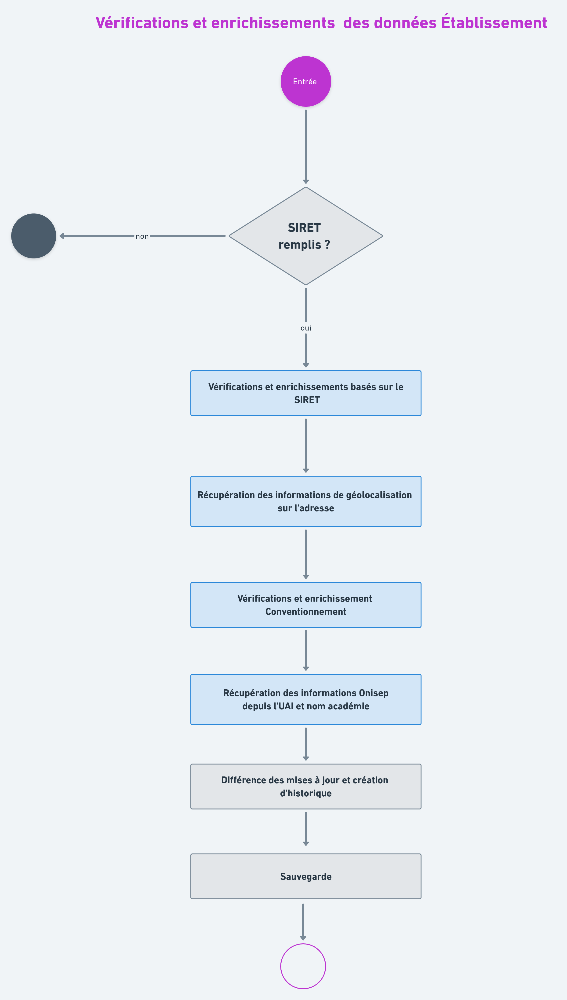
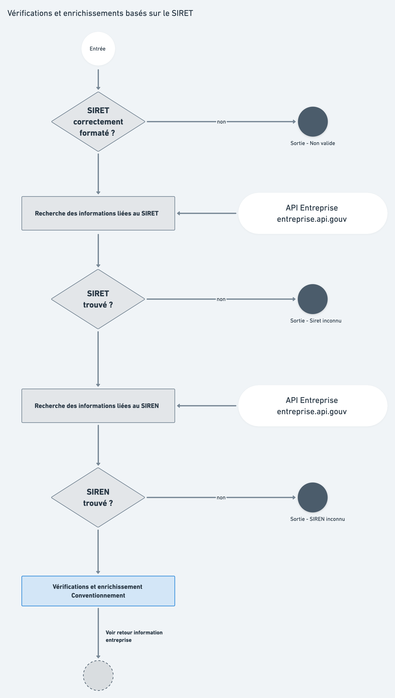
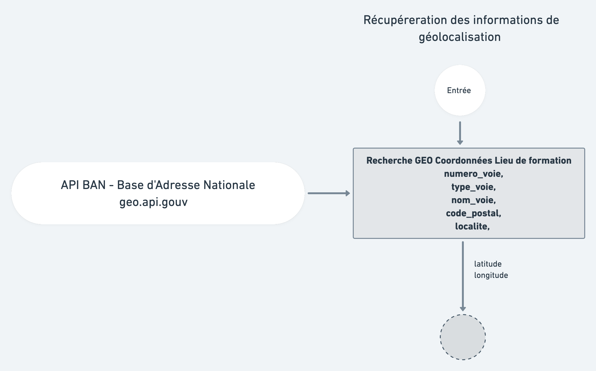
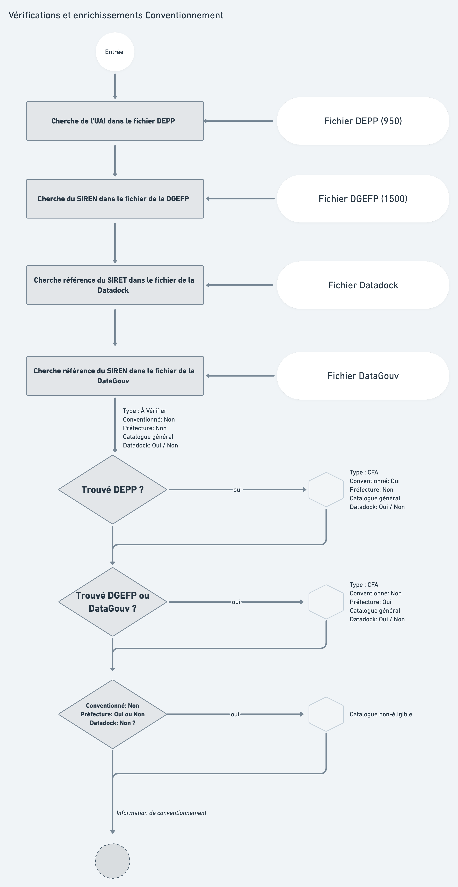
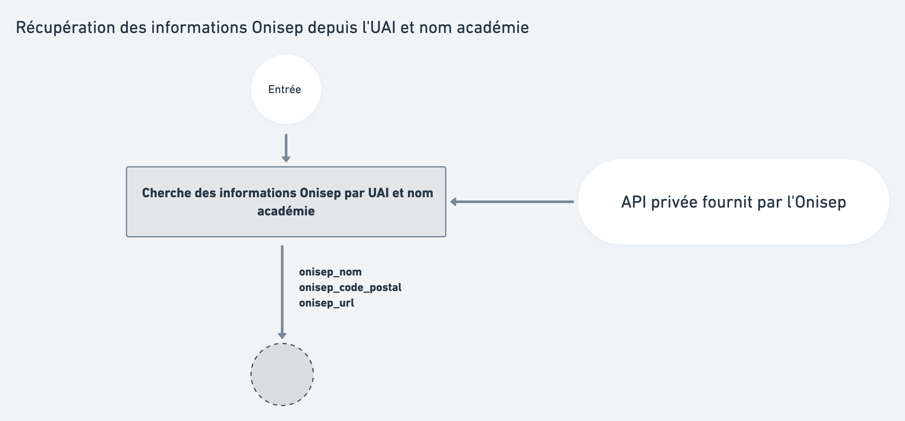

# Traitements liés aux établissements

## Vue d’ensemble


## Détails des traitements



Les différents traitements sur un établissement se font autour de la donnée pivot **SIRET**.

1.  Vérifications et enrichissements basés sur le **SIRET**
2. Récupération des informations de géolocalisation sur l'adresse
3. Vérifications et enrichissements **Conventionnement**
4. Récupération des **informations Onisep** depuis l'UAI et nom académie

### 1. Vérifications et enrichissements via Entreprise.api.gouv.fr



La consolidation des informations de l'entreprise se fait par l’intermédiaire de l'API entreprise [https://entreprise.api.gouv.fr/](https://entreprise.api.gouv.fr/). 

Si le SIRET existe dans l'api, nous retournons les informations suivantes : 

```javascript
{
  api_entreprise_reference: {
    type: Boolean,
    default: false,
    description: "L'établissement est trouvé via l'API Entreprise",
  },
  siege_social: {
    type: Boolean,
    default: false,
    description: "L'établissement est le siège social de l'entreprise",
  },
  etablissement_siege_siret: {
    type: String,
    default: null,
    description: "Numéro SIRET du siège social de l'entreprise",
  },
  siret: {
    type: String,
    default: null,
    description: "SIRET recherché",
  },
  siren: {
    type: String,
    default: null,
    description: "Numéro siren de l'établissement",
  },
  naf_code: {
    type: String,
    default: null,
    description: "Code NAF",
  },
  naf_libelle: {
    type: String,
    default: null,
    description: "Libellé du code NAT (ex: Enseignement secondaire technique ou professionnel)",
  },
  date_creation: {
    type: Date,
    default: null,
    description: "Date de création de l'établissement",
  },
  diffusable_commercialement: {
    type: Boolean,
    default: true,
    description: "Les informations de l'établissement sont elles diffusables commercialement",
  },
  enseigne: {
    type: String,
    default: null,
    description: "Enseigne de l'établissement ou de l'entreprise",
  },
  date_fermeture: {
    type: Date,
    default: null,
    description: "Date de cessation d'activité de l'établissement",
  },
  ferme: {
    type: Boolean,
    default: false,
    description: "l'établissement a cessé son activité",
  },
  
  
  
  // Ci-dessous les champs non utilisés dans les scripts aujourd’hui 
  date_mise_a_jour: {
    type: Date,
    default: null,
    description: "Date de la dernière mise à jour des informations",
  },
  tranche_effectif_salarie: {
    type: Object,
    default: {},
    description: "Tranche salariale",
  },
  
  // Ci-dessous les informations concernant le siège social de l'entreprise
  // Elles permettent de réaliser des vérifications supplémentaires si nécessaire 
  entreprise_siren: {
    type: String,
    default: null,
    description: "Numéro siren",
  },
  entreprise_procedure_collective: {
    type: Boolean,
    default: false,
    description: "Procédure collective",
  },
  entreprise_enseigne: {
    type: String,
    default: null,
    description: "Enseigne",
  },
  entreprise_code_effectif_entreprise: {
    type: String,
    default: null,
    description: "Code effectf",
  },
  entreprise_forme_juridique_code: {
    type: String,
    default: null,
    description: "Code forme juridique",
  },
  entreprise_forme_juridique: {
    type: String,
    default: null,
    description: "Forme juridique (ex: Établissement public local d'enseignement)",
  },
  entreprise_raison_sociale: {
    type: String,
    default: null,
    description: "Raison sociale",
  },
  entreprise_nom_commercial: {
    type: String,
    default: null,
    description: "Nom commercial",
  },
  entreprise_date_creation: {
    type: Date,
    default: null,
    description: "Date de création",
  },
  entreprise_date_radiation: {
    type: String,
    default: null,
    description: "Date de radiation",
  },
  entreprise_naf_code: {
    type: String,
    default: null,
    description: "Code NAF",
  },
  entreprise_naf_libelle: {
    type: String,
    default: null,
    description: "Libellé du code NAT (ex: Enseignement secondaire technique ou professionnel)",
  },
  entreprise_date_fermeture: {
    type: Date,
    default: null,
    description: "Date de cessation d'activité",
  },
  entreprise_ferme: {
    type: Boolean,
    default: false,
    description: "A cessé son activité",
  },
  entreprise_siret_siege_social: {
    type: String,
    default: null,
    description: "Numéro siret du siége social",
  },
  entreprise_categorie: {
    type: String,
    default: null,
    description: "Catégorie (PME, TPE, etc..)",
  },
  entreprise_tranche_effectif_salarie: {
    type: Object,
    default: {},
    description: "Tranche salarié",
  },
}
```

**Vérification par le SIRET**


retrouvez le code source de ce script sur : [https://github.com/mission-apprentissage/tables-correspondances/blob/master/server/src/logic/handlers/siretHandler.js](https://github.com/mission-apprentissage/tables-correspondances/blob/master/server/src/logic/handlers/siretHandler.js)


**Consolidation des données**

* API Siren 
* API Entreprise 

_Vous pouvez retrouver les détails du traitement "Vérifications et enrichissements  **Conventionnement**" sur cette page section numéro 5._ 

### 2. Récupération des informations de géolocalisation via geo.api.gouv.fr

[https://geo.api.gouv.fr/adresse](https://geo.api.gouv.fr/adresse)

|  |  |
| :--- | :--- |
|  | Recherche geo coordonnées - Latitude et longitude  |

### 3. Vérifications et enrichissements Conventionnement



#### Règles de conventionnements .

**Vérifications CFA conventionné, CFA déclaré en préfecture et condition certification datadock**

* Etablissement en capacité de proposer des actions de formations par apprentissage, c’est-à-dire

  soit un CFA précédemment conventionné avec un conseil régional, présent dans la liste établie par la DEPP \(vérification sur l'UAI\)

* soit un établissement connu en tant qu'organisme de formation dûment déclaré en préfecture \(vérification sur le SIRET\)...
* ...qui, s’il n’est pas un CFA conventionné avec un conseil régional, a pu faire attester la qualité de ses actions de formation suivant les termes du décret du décret du 30 juin 2015. À cette fin, la mission a utilisé la base de données du groupement d’intérêt économique DATADOCK réunissant les OPCO \(vérification sur le SIRET\).

**Vérification des codes UAI**

* s’assurer que le code UAI partie établissement existe et correspond à un “numéro UAI CFA”.
* identifier les UAI invalides afin de permettre une investigation/ correction des données en base \(BCE, ACCE, ...\)
* identifier les erreurs de mariage entre UAI CFA et UAI site
* s’assurer de la complétude des UAI site dans le catalogue des formations

**Vérification RNCP**

Vérifier que l'établissement est présent dans la liste des certificateurs pour délivrer ce titre, dans la fiche RNCP de la certification consultable via Répertoire national des certifications professionnelles \(RNCP\)

Vérifier que l'établissement est habilité à délivrer des titres professionnels au RNCP \(Organisme certifié 2015\) : Vérification sur les fiches RNCP.

**Identification des établissements principaux vs secondaires**

* identifier les établissements secondaires 
* identifier les liens établissements principaux - établissements secondaires sur les SIRET 
* identifier les liens établissements sur les UAI CFA et UAI site 
* identifier les liens établissements sur les OF responsable, OF formateur

**Conditions d'entrée d'un établissement sur les SI Affelnet et / ou Parcoursup**

Besoins :

* quand, je consulte le catalogue des offres de formation en Apprentissage  
* je veux, être assuré que l'établissement est “légitime” au sein de Parcoursup ou Affelnet afin de garantir la conformité de la formation et de l'organisme délivrant une certification en apprentissage et d’éviter des contrôles manuels chronophage

Cette spécification répond au besoin de chargement des établissements en apprentissage pour les besoins de Parcoursup ou Affelnet afin d’améliorer le nombre de formations proposées en apprentissage au sein des choix de formations offertes par les SI de l'Education Nationale et de l'Enseignement Supérieur.

Note DGESIP du 18 février 2020

Note DGESCO du 13 janvier 2020

**Vérification du conventionnement**


retrouvez le code source de ce script sur : [https://github.com/mission-apprentissage/tables-correspondances/blob/master/server/src/logic/controllers/conventionController.js\#L47](https://github.com/mission-apprentissage/tables-correspondances/blob/master/server/src/logic/controllers/conventionController.js#L47)


**Consolidation des données**

* API Enseignement Supérieur 
* Fichiers de la DEPP 
* Fichier DGER - Agriculture

**Traitements réalisés en cascade au moment de l'import d'Offre Info**

### 4. Vérifications et enrichissements via l'Onisep



**Recherche des informations supplémentaires collectées par l'Onisep**


retrouvez le code source de ce script sur : [https://github.com/mission-apprentissage/tables-correspondances/blob/master/server/src/logic/controllers/onisep/onisepController.js\#L4](https://github.com/mission-apprentissage/tables-correspondances/blob/master/server/src/logic/controllers/onisep/onisepController.js#L4)


**Consolidation des données**

* API Privée Onisep

~~~~

~~-----~~

#### ~~Vérification des liens OPCO - CFA~~

* ~~identifier les CFA dépendants d'un OPCO~~
* ~~identifier les formations sur les métiers du secteur des entreprises de l'OPCO~~

### 5. Historique des modifications et sauvegardes

Les mises à jours des établissements sont quotidiennes.

Lors des mises à jour l'historique des modifications est stocké sur chaque établissement.

Un mécanisme de sauvegarde est en place et effectue un backup quotidien de toute la base des établissements.


